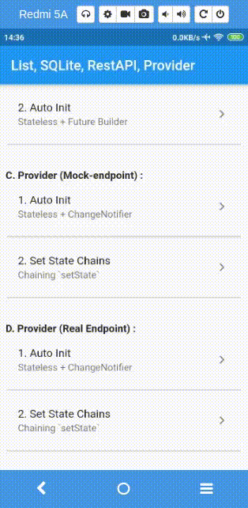
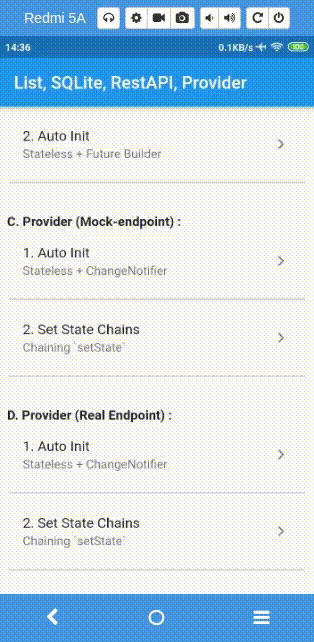

# Complete Demo of Stateless, SQLite, RestAPI and Provider

## Part 1
### Stateful vs Stateless

work in progress

## Part 2
### SQLIte

work in progress

## Part 3
### Calling API (Mocked)

## Part 4
### Calling API (Http)

1. For Auto Init [Here](https://github.com/ejabu/flutter_sqlite_api_provider/blob/master/lib/d_screen/1_auto_init/auto_init_screen.dart)
2. Set State Chains Screen [Here](https://github.com/ejabu/flutter_sqlite_api_provider/blob/master/lib/d_screen/2_auto_init_chaining/auto_init_screen.dart)